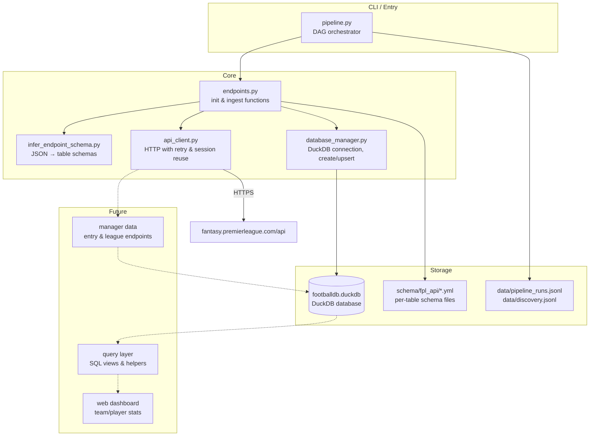

# FPL Vault

Ingest Fantasy Premier League data from the [undocumented public API](https://fantasy.premierleague.com/api/) into a local [DuckDB](https://duckdb.org/) database. Schema-aware, dependency-ordered, with drift detection.

## Current state

Working pipeline that ingests 7 endpoints into a DuckDB database. Schema definitions are version-controlled as per-table YAML files. The orchestrator handles topological ordering, retries, and real-time progress reporting.

**Ingested endpoints**: bootstrap-static, event-status, fixtures, team/set-piece-notes, event/{id}/live, dream-team/{id}, element-summary/{id}

**Not yet implemented**: manager/league endpoints, authentication-required endpoints (see [API_ENDPOINTS.md](API_ENDPOINTS.md) for the full catalog).

## Quick start

```bash
# Install dependencies
uv sync

# Create tables from inferred schemas (dev database)
uv run python pipeline.py --init

# Ingest data
uv run python pipeline.py

# Same against the production database
uv run python pipeline.py --init --live
uv run python pipeline.py --live

# Run specific tasks only
uv run python pipeline.py --tasks fixtures,event-status
```

First-time `--init` writes per-table schema files to `schema/fpl_api/`. Subsequent runs validate API responses against those schemas and log any drift to `data/discovery.jsonl`.

Set `LIMIT_IDS=true` and `MAX_IDS=3` in `.env` for fast dev runs (caps parameterized loops).

## Architecture



### Component overview

**`pipeline.py`** — DAG orchestrator. `Pipeline` runs named `Task` functions in dependency order (Kahn topological sort). Supports `--init` (schema + table creation) and normal (data ingestion) modes. Writes `pipeline_progress.json` for real-time status and `pipeline_runs.jsonl` as an append-only execution log. `--tasks` flag runs a subset.

**`endpoints.py`** — All endpoint ingestion logic. Each endpoint pair (`init_*` / `ingest_*`) follows the same pattern: infer or load schema, apply key-map modifiers (singletons, composite unique indexes), create or upsert. `SCHEMA_DIR` env var controls where schemas are stored (default `schema/fpl_api`).

Key internal helpers:
- `_resolve_schema()` — prefers YAML schema over API-inferred types, logs drift when they differ
- `_apply_key_map_modifiers()` — injects synthetic `id` columns for singleton tables, marks unique-on columns for tables without natural primary keys
- `_validate_and_log_schema()` — compares API response columns against the authoritative YAML schema, writes drift events to `discovery.jsonl`

**`database_manager.py`** — DuckDB wrapper. `DatabaseManager` handles connection lifecycle. Key functions:
- `create_table()` — generates and optionally executes `CREATE TABLE` from a schema dict
- `upsert_rows()` — parameterized `INSERT … ON CONFLICT DO UPDATE`
- `fetch_column()` — reads a single column for parameterized endpoint loops
- `table_exists()` — existence check
- `load_table_schemas()` — reads `schema/fpl_api/*.yml` into schema dicts
- `save_table_schema()` — writes a single schema dict to its per-table YAML file
- `backup_db()` — timestamped `.bak` copy before live runs

**`infer_endpoint_schema.py`** — Walks a JSON API response and produces table schemas. `infer_response_schema()` handles nested endpoints via `table_prefix`. `infer_record_schema()` extracts column names, types, and nullability from record arrays. Datetime strings are detected via ISO format pattern.

**`api_client.py`** — Thin `requests` wrapper. Session reuse, 3-retry exponential backoff, 30s timeout.

### Schema management

Tables are defined as individual YAML files:

```
schema/fpl_api/
├── chips.yml
├── element_stats.yml
├── element_types.yml
├── elements.yml
├── events.yml
├── fixtures.yml
├── game_config.yml
├── game_settings.yml
├── phases.yml
└── teams.yml
```

Each file is a self-contained table definition:

```yaml
name: teams
primary_key: id
columns:
  - name: id
    data_type: INTEGER
    tests: [not_null]
  - name: name
    data_type: TEXT
    tests: [not_null]
```

**`TABLE_KEY_MAP`** (in `endpoints.py`) handles tables without a natural `id` column — singletons get a synthetic `id = 1`, multi-column keys use composite `UNIQUE INDEX`.

## Configuration

All via `.env` (see `.env.example`):

| Variable | Default | Purpose |
|---|---|---|
| `DB_NAME` | `footballdb` | Database filename |
| `DATA_DIR` | `data` | Data and log directory |
| `SCHEMA_DIR` | `schema/fpl_api` | Per-table schema files |
| `REQUEST_DELAY` | `0.5` | Seconds between API calls in loops |
| `LIMIT_IDS` | `false` | Enable ID capping for dev runs |
| `MAX_IDS` | `0` | Max IDs to process when `LIMIT_IDS` is on |

Dev mode appends `_dev` to the database name. Production (`--live`) omits it and takes a backup before running.

## Logging

- **`data/pipeline_runs.jsonl`** — append-only log of every task execution (started, success, failed with error)
- **`data/pipeline_progress.json`** — atomically-written snapshot of the current run's progress (task status, percentage for parameterized loops)
- **`data/discovery.jsonl`** — schema drift events: new columns, missing columns, type changes, table creation. Written during `--init` and whenever the API response diverges from the YAML schema.
